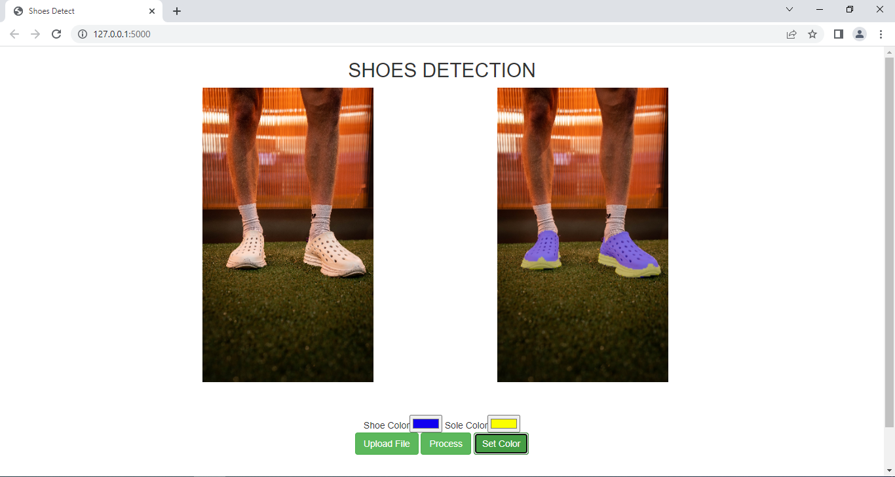

# Kene Shoe Detection with Segmentation

This is code that provide shoe top part and sole part segmentation.

## Setup
```bash
pip install -r requirements.txt
```
python==3.7.2\
tensorflow==1.14.0\
tensorflow-gpu==1.14.0\
opencv-python==4.3.0.38\
imageio\
pillow\
flask

## If you can't install tensorflow==1.14.0 with pip install, here is manual way.

1. Download tensorflow-gpu==1.14.0 -> (https://pypi.org/project/tensorflow-gpu/1.14.0/#files)
2. Download tensorflow=1.14.0 -> (https://pypi.org/project/tensorflow/1.14.0/#files)
2. Install it pip install 'file name'


## Extract model
1. Download `model`(https://drive.google.com/file/d/1TbMzkAi9a9HMsG1Z-LQAoCS9Gh0zqTrU/view?usp=share_link). And extract it in the root directory.
2. Download `model_sole`(https://drive.google.com/file/d/1ydssVrkh2FBh-1nelMsCPc-D8_4JEVfy/view?usp=share_link). And extract it in the root directory.

## Running code
python Server.py\
http://127.0.0.1:5000

## Result
